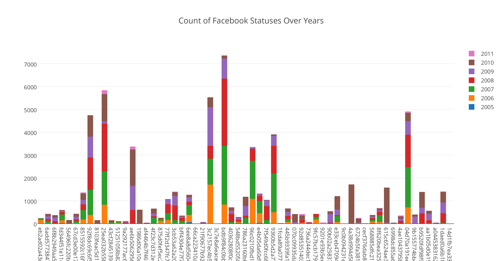
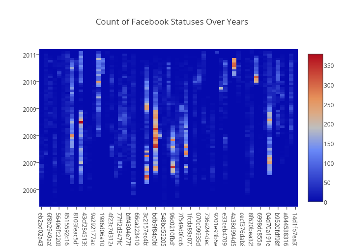

# risk-behavior-analysis

The goal of this project is to examine the “digital media neighborhood” of 60 adolescents from West Philadelphia and assess its relationship with their health risk behaviors. 

####The following bar graph and heatmap represents the count of FB statuses over years by different anonymized users

