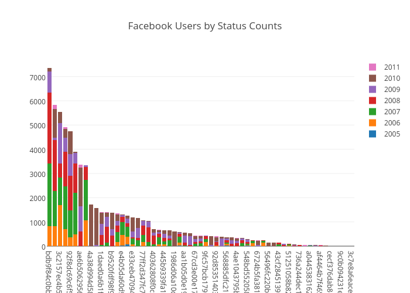

# risk-behavior-analysis

The goal of this project is to examine the “digital media neighborhood” of 60 adolescents from West Philadelphia and assess its relationship with their health risk behaviors. 

The following bar graph and heatmap represents the count of FB statuses over years by different anonymized users

These pie charts show the percentage of users who make FB posts with sex, alcohol, drugs or violence content

This is a word cloud of the top 500 most frequently used words

